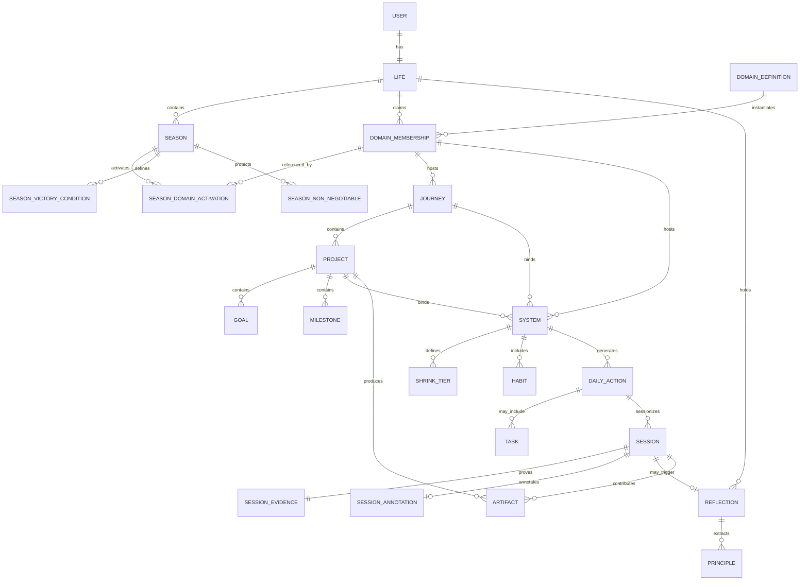
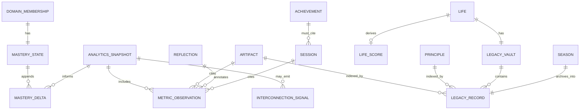
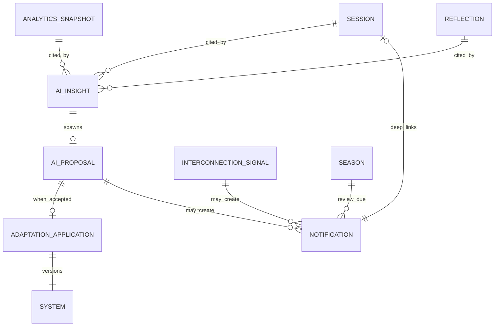
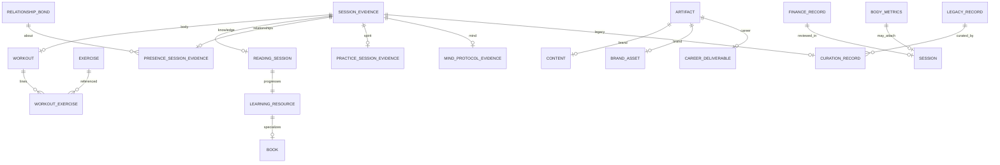

# AETHER OS V2 — MASTER DATA MODEL

**Classification:** Internal logical data architecture specification  
**Status:** Binding data-model doctrine  
**Sources of truth (only):**  
- `AETHER-OS-V2-MASTER-PRODUCT-VISION.md`  
- `AETHER-OS-V2-MASTER-INFORMATION-ARCHITECTURE.md`  
- `AETHER-OS-V2-MASTER-DOMAIN-ARCHITECTURE.md`  
**Audience:** Founders, product, architecture, data leadership  
**Constraint:** Logical data architecture only. No database technology. No schemas-as-code. No APIs. No UI. No implementation.

This document defines **the nouns of Aether OS as durable logical entities**: what they are, who owns them, how they relate, how they live and die, and what business rules bind them.

**Primary object:** `Session` (Session of Becoming).  
**North-star filter:** Every entity must help execute becoming across interconnected Domains with evidence that compounds into Mastery and Legacy — or it does not belong.

---

# 0. Data Model Laws

1. **Evidence primacy.** Progress-affecting writes require `Session` evidence (or explicit Artifact completion bound to Sessions).  
2. **Intention is scaffolding.** Plans, Goals, Daily Actions, and drafts do not score Mastery alone.  
3. **Immutability of truth.** Completed Session evidence is append-only in spirit; corrections are compensating events, not silent rewrites.  
4. **Single primary Domain per Session.** Multi-domain days = multiple Sessions.  
5. **Single primary owner per Project.** Cross-links allowed; dual ownership forbidden.  
6. **Derived vs authoritative.** Analytics, Life Score, Mastery aggregates, and Interconnection Signals are derived; they must cite authoritative sources.  
7. **Season gates activation.** Domains exist enduringly; Season activates a subset (typically 3–5).  
8. **Archive by default.** Seasons and completed arcs retain; delete is exceptional integrity event.  
9. **AI writes Proposals, not Mastery.** `AIInsight` / `AIProposal` never directly mutate scoreboard aggregates.  
10. **Task is not primary.** If modeled, `Task` is a subordinate operational leaf — never the Life container.

---

# 1. Entity Catalog Conventions

For every entity:

| Field group | Meaning |
|-------------|---------|
| **Purpose** | Why the entity exists in the OS |
| **Description** | What it is |
| **Owner Domain** | Organ that owns it, or `OS` / `Life` if cross-cutting |
| **Parent Entity** | Structural parent (containment) |
| **Child Entities** | Contained or generated children |
| **Relationships** | Non-parent associations |
| **Required Fields** | Logical attributes that must exist |
| **Optional Fields** | Logical attributes that may exist |
| **Lifecycle** | States and transitions |
| **Business Rules** | Normative constraints |

**Identifier convention (logical):** every entity has a stable `id` and `userId` (except global catalog definitions shared by product).  
**Time convention:** `createdAt`, `updatedAt` implied on mutable entities; evidence entities prefer `occurredAt` / `completedAt`.

**Owner Domain values:** `Body` | `Mind` | `Spirit` | `Career` | `Brand` | `Knowledge` | `Wealth` | `Relationships` | `Projects` | `Legacy` | `OS` | `Life`

---

# 2. Core Identity & Life Entities

---

## 2.1 User

### Purpose
Account holder of the Personal OS — the human who authenticates and whose Life is operated.

### Description
The security and tenancy root for all personal data. Not the same as Identity-of-becoming.

### Owner Domain
`OS`

### Parent Entity
None (tenancy root)

### Child Entities
`Life`, `IdentityProfile`, auth/session devices (integrity), notification preferences

### Relationships
- Has one `Life`  
- Has one or more `IdentityProfile` facets over time  
- Owns all user-scoped entities

### Required Fields
- `id`  
- `accountStatus` (`active` | `suspended` | `pending_deletion` | `deleted`)  
- `createdAt`

### Optional Fields
- `displayName`  
- `timezone`  
- `locale`  
- `personaDefault` (Beginner | Professional | Founder | Athlete | Engineer | Creator | Student)  
- `deletedAt`

### Lifecycle
`pending` → `active` → `suspended` ↔ `active` → `pending_deletion` → `deleted` (tombstone)

### Business Rules
- Soft-delete retains Archive eligibility until integrity purge.  
- User deletion is exceptional and audited.  
- Persona default changes coaching defaults, not entity graph shape.

---

## 2.2 Life

### Purpose
Continuous container of becoming across decades (Vision §6.1).

### Description
The whole human story for one User — sequence of Seasons, enduring Domains, Mastery, Legacy.

### Owner Domain
`Life`

### Parent Entity
`User`

### Child Entities
`Season`, `DomainMembership`, `MasteryMap`, `LegacyVault`, organism-level Analytics snapshots

### Relationships
- Composed of many `Season`  
- References all enduring `DomainDefinition` via memberships  
- Feeds `LegacyRecord` over time

### Required Fields
- `id`  
- `userId`  
- `startedAt` (Life on Aether)

### Optional Fields
- `northStarStatement` (rare, long-horizon)  
- `restMode` (`false` | `true` inter-season)

### Lifecycle
`active` for life of User; may enter `rest` between Seasons; ends only with User deletion

### Business Rules
- Exactly one Life per User.  
- Life never resets on calendar New Year.  
- Rest mode freezes Operate pressure; Archive/Legacy remain readable.

---

## 2.3 Identity / IdentityProfile

### Purpose
Persistent “player character” language of becoming — identity over goals (Principle 3).

### Description
Identity claims and tags that orient Seasons and Domains. Distinct from account User.

### Owner Domain
`Life` (stewarded; Season may hold chapter identity)

### Parent Entity
`Life` (profile); Season holds `Season.identityStatement` as chapter contract

### Child Entities
`IdentityTag` (Athlete, Builder, Writer, Operator, etc.)

### Relationships
- Informs `Season`  
- Referenced by Reflections when identity language is reviewed  
- Updated only when earned (Reflection evidence)

### Required Fields
- `id`  
- `lifeId`  
- `coreStatement`  
- `status` (`draft` | `active` | `superseded`)

### Optional Fields
- `tags[]`  
- `earnedAt`  
- `supersededById`  
- `evidenceReflectionIds[]`

### Lifecycle
`draft` → `active` → `superseded` (append-only history)

### Business Rules
- Identity upgrades require Reflection evidence; affirmations alone insufficient.  
- Season identity may be more specific than Life identity but must not contradict without explicit Season Reflection.  
- Not a scoreboard object.

---

## 2.4 DomainDefinition

### Purpose
Catalog definition of an enduring organ (the ten Domains).

### Description
Product-level definition: Body, Mind, Spirit, Career, Brand, Knowledge, Wealth, Relationships, Projects, Legacy.

### Owner Domain
`OS` (catalog)

### Parent Entity
None (catalog)

### Child Entities
None required; templates may reference

### Relationships
- Instantiated per User via `DomainMembership`  
- Activated per Season via `SeasonDomainActivation`

### Required Fields
- `key` (stable enum key)  
- `name`  
- `organMeaning`  
- `isExpandable` (future Domains)

### Optional Fields
- `defaultInterconnectionPorts[]`  
- `admissionCostNotes`

### Lifecycle
Product-versioned; rarely retired (`deprecated`)

### Business Rules
- Users do not invent arbitrary DomainDefinitions without expansion governance.  
- Adding a Domain to a Season is expensive (Law of Minimum Domains).

---

## 2.5 DomainMembership

### Purpose
User’s enduring relationship to a Domain organ across Life.

### Description
Whether the User has ever claimed the Domain; historical continuity even when dormant.

### Owner Domain
Matches `DomainDefinition.key`

### Parent Entity
`Life`

### Child Entities
`Journey`, standing `System`, Domain `MasteryState`, Domain Principles index

### Relationships
- References `DomainDefinition`  
- Many `SeasonDomainActivation` over time

### Required Fields
- `id`  
- `lifeId`  
- `domainKey`  
- `status` (`claimed` | `dormant` | `archived_membership`)  
- `claimedAt`

### Optional Fields
- `domainIdentityTag`  
- `notes`

### Lifecycle
`claimed` ↔ `dormant`; exceptional `archived_membership`

### Business Rules
- Dormant ≠ deleted history.  
- Membership alone does not generate Daily Actions; Season activation does.

---

## 2.6 Season

### Purpose
Bounded chapter of identity with victory conditions (Vision §6.2, Law of Finite Seasons).

### Description
Finite campaign: identity, duration, domains in play, non-negotiables, archive policy.

### Owner Domain
`Life`

### Parent Entity
`Life`

### Child Entities
`SeasonDomainActivation`, `SeasonVictoryCondition`, `SeasonNonNegotiable`, Season Reviews (`Reflection`), `SeasonArchivePackage`

### Relationships
- Selects Domains via activations  
- Bounds which Journeys are campaign-active  
- Closes into Legacy/Archive

### Required Fields
- `id`  
- `lifeId`  
- `identityStatement`  
- `startsOn`  
- `endsOn` (planned)  
- `status`  
- `archivePolicy` (`retain_default`)

### Optional Fields
- `actualEndedOn`  
- `theme`  
- `restAfter` (`true` | `false`)  
- `templateKey` (Operator Edge, Wedge Mastery, etc.)

### Lifecycle
`draft` → `active` → `closing` → `archived` | `abandoned_archived`  
Also: `active` → `amending` → `active`

### Business Rules
- No Operate without `active` Season (except read-only Legacy during rest).  
- Victory conditions must be evidence-checkable.  
- Typical primary Domains 3–5.  
- Mid-season Domain add requires amend + recommit.  
- Archive by default; delete exceptional.

---

## 2.7 SeasonDomainActivation

### Purpose
Bind a Domain into a Season with a role and load.

### Description
Activation record: primary / supporting / monitored.

### Owner Domain
Activated Domain

### Parent Entity
`Season`

### Child Entities
None (links to Journeys/Systems in play)

### Relationships
- References `DomainMembership`  
- Constrains Daily Action generation

### Required Fields
- `id`  
- `seasonId`  
- `domainKey`  
- `role` (`primary` | `supporting` | `monitored`)  
- `activatedAt`

### Optional Fields
- `clarityBudgetWeight`  
- `pausedAt`  
- `pauseReason`

### Lifecycle
`active` → `paused` → `active`; ends when Season archives

### Business Rules
- Sum of `primary` Domains should respect minimum-domains clarity.  
- `monitored` may emit signals without full Session load.  
- Forbidden: all ten `primary` at equal load.

---

## 2.8 SeasonVictoryCondition

### Purpose
Definition of “season won” as evidence-checkable proof targets.

### Description
Chapter success criteria subordinate to identity.

### Owner Domain
`Life` (Season-scoped); may reference Domains

### Parent Entity
`Season`

### Child Entities
None

### Relationships
- May reference Goals, Projects, KPI thresholds, Artifact completions

### Required Fields
- `id`  
- `seasonId`  
- `statement`  
- `evidenceType` (`session_integrity` | `project_completion` | `artifact` | `composite`)  
- `status` (`open` | `met` | `unmet` | `waived_with_reflection`)

### Optional Fields
- `targetRef` (Goal/Project/Artifact ids)  
- `threshold`  
- `evaluatedAt`

### Lifecycle
`open` → `met` | `unmet` | `waived_with_reflection` at Season close

### Business Rules
- Vibes-only conditions forbidden.  
- Waiver requires Season Reflection.  
- Goals never outrank Season identity statement.

---

## 2.9 SeasonNonNegotiable

### Purpose
Declare Systems/Sessions that shrink but do not die under compression.

### Description
Law of Shrink, Don’t Skip encoded as data.

### Owner Domain
Referenced Domain

### Parent Entity
`Season`

### Child Entities
None

### Relationships
- References `System` and/or Session template

### Required Fields
- `id`  
- `seasonId`  
- `domainKey`  
- `systemId`  
- `shrinkTierAllowed` (`true`)

### Optional Fields
- `notes`  
- `priorityRank`

### Lifecycle
Active for Season; archived with Season

### Business Rules
- Non-negotiables must have predefined shrink tiers on the System.  
- Skipping non-negotiable emits integrity/risk signals.

---

# 3. Transformation Stack Entities

---

## 3.1 Journey

### Purpose
Structured multi-week/month arc inside a Domain (Vision §6.4).

### Description
Curriculum and narrative momentum; ends while Domain persists.

### Owner Domain
Parent Domain

### Parent Entity
`DomainMembership` (and optionally bound to `Season`)

### Child Entities
`Project`, Journey-bound `System` links, Journey `Reflection`, phase markers

### Relationships
- Many Projects  
- Many Systems (bound)  
- Progresses only via Sessions  
- Season may mark `campaignActive`

### Required Fields
- `id`  
- `domainKey`  
- `lifeId`  
- `title`  
- `thesis`  
- `status`  
- `startedOn`

### Optional Fields
- `seasonId`  
- `plannedEndOn`  
- `phase`  
- `curriculumRef`

### Lifecycle
`planned` → `active` → `completed` | `abandoned` → archived forms

### Business Rules
- Journey without Sessions is fiction (no Mastery credit).  
- Abandonment is honest archiveable state.  
- Clarity limits concurrent Journeys per Domain/Season.

---

## 3.2 Project

### Purpose
Concrete artifact/outcome — externalized proof (Vision §6.5).

### Description
Finite make/outcome with definition of done. Primary owner Domain per Domain Architecture matrix.

### Owner Domain
Single primary Domain (portfolio creation typically `Projects`; domain-local allowed)

### Parent Entity
`Journey` (primary) or Domain-level standing under membership

### Child Entities
`Goal`, `Milestone`, linked Systems, produced `Artifact`

### Relationships
- Achieved via Systems + Sessions  
- May cross-link Brand distribution, Career deliverable, Wealth event  
- Completion feeds Mastery/Legacy candidates

### Required Fields
- `id`  
- `ownerDomainKey`  
- `lifeId`  
- `title`  
- `outcomeStatement`  
- `definitionOfDone`  
- `status`

### Optional Fields
- `journeyId`  
- `seasonId`  
- `crossLinks[]` (`{domainKey, role}`)  
- `riskFlags`

### Lifecycle
`ideation` → `active` → `completed` | `abandoned` → `archived`

### Business Rules
- Single primary `ownerDomainKey`.  
- Hours alone do not complete craft Projects.  
- “Almost done” ≠ `completed`.  
- WIP caps enforced at Season clarity layer.  
- Domain-local ownership rules from Domain Architecture §2.9 apply.

---

## 3.3 Goal

### Purpose
Specific proof targets under Project/Journey (Vision §6.6).

### Description
Mid-stack focus energy — never top of hierarchy.

### Owner Domain
Inherited from Project/Journey Domain

### Parent Entity
`Project` or `Journey`

### Child Entities
None (achieved via Systems/Sessions)

### Relationships
- Linked Systems  
- Evaluated in Analytics  
- May back SeasonVictoryCondition

### Required Fields
- `id`  
- `parentType` (`project` | `journey`)  
- `parentId`  
- `statement`  
- `status`  
- `evidenceMode`

### Optional Fields
- `targetValue`  
- `unit`  
- `dueOn`  
- `seasonId`

### Lifecycle
`open` → `achieved` | `missed` | `retired`

### Business Rules
- Cannot outrank Season identity.  
- Achievement requires Session/Artifact evidence per `evidenceMode`.  
- Intention inflation: creating Goals is not progress.

---

## 3.4 Milestone

### Purpose
Optional mid-proof point on a Project — still evidence-bound.

### Description
Checkpoint toward definition of done; not a vanity badge.

### Owner Domain
Inherited from Project

### Parent Entity
`Project`

### Child Entities
None

### Relationships
- May require subset of Sessions or interim Artifact

### Required Fields
- `id`  
- `projectId`  
- `name`  
- `definitionOfDone`  
- `status`

### Optional Fields
- `targetOn`  
- `evidenceRefs[]`

### Lifecycle
`open` → `hit` | `missed` | `skipped_with_reflection`

### Business Rules
- Not Achievement gamification.  
- Skip requires honesty in Reflection if it affected victory conditions.

---

## 3.5 System

### Purpose
Repeatable protocol that makes goals inevitable — heart of Aether (Vision §6.7).

### Description
When, what, how long, what done means, shrink tiers, failure behavior.

### Owner Domain
Owning Domain

### Parent Entity
`DomainMembership`; may bind to `Journey` / `Project`

### Child Entities
`Habit`, generated `DailyAction`, `ShrinkTier`, Session templates

### Relationships
- Generates Habits and Daily Actions  
- Tuned by Reflection + Analytics  
- Referenced by SeasonNonNegotiable

### Required Fields
- `id`  
- `domainKey`  
- `lifeId`  
- `name`  
- `protocol` (logical structure: schedule, duration, doneDefinition)  
- `status`  
- `shrinkPolicy` (required if non-negotiable)

### Optional Fields
- `journeyId`  
- `projectId`  
- `cadence`  
- `energyCostClass`  
- `interconnectionEmitRules`

### Lifecycle
`draft` → `active` → `paused` → `active` → `retired`  
Under friction: scope uses ShrinkTier rather than delete

### Business Rules
- If it cannot be described as a System, it is not ready as Domain commitment.  
- Shrink don’t skip: pausing entire System on non-negotiable is discouraged vs shrink tier.  
- Retroactive edits do not rewrite past Session evidence.  
- AI may propose System changes; human confirmation applies.

---

## 3.6 ShrinkTier

### Purpose
Encode faithful minima for a System (Law of Shrink, Don’t Skip).

### Description
Predefined reduced Session scopes that still count when completed with integrity.

### Owner Domain
Inherited from System

### Parent Entity
`System`

### Child Entities
None

### Relationships
- Selected at Session start under load

### Required Fields
- `id`  
- `systemId`  
- `tierRank` (`full` | `standard_shrink` | `minimum_faithful`)  
- `doneDefinition`

### Optional Fields
- `durationHint`  
- `notes`

### Lifecycle
Versioned with System; historical Sessions retain tier id used

### Business Rules
- Shrink tiers must exist before crisis — not invented after the fact to farm scoreboard.  
- Minimum faithful still requires evidence close.

---

## 3.7 Habit

### Purpose
Atomic recurring behavior supporting a System (Vision §6.8).

### Description
Implementation detail — necessary, insufficient alone.

### Owner Domain
Inherited from System

### Parent Entity
`System`

### Child Entities
None

### Relationships
- Supports System; may appear inside Daily Actions

### Required Fields
- `id`  
- `systemId`  
- `name`  
- `status`

### Optional Fields
- `trigger`  
- `cue`

### Lifecycle
`active` → `retired`

### Business Rules
- Habit streak is never the ceiling of the product.  
- Habit completion without Session evidence of the parent System does not move Domain Mastery alone (Session remains primary).  
- Not a parent of Life architecture.

---

## 3.8 DailyAction

### Purpose
Date-scoped translation of Systems/Journeys into today’s checklist (Vision §6.9).

### Description
Derived operational intent for a calendar date; groups into Sessions.

### Owner Domain
Inherited from generating System/Domain

### Parent Entity
Generated from `System` (+ Season activation); belongs to `Life` date lane

### Child Entities
May spawn `Session`; may contain subordinate `Task` leaves

### Relationships
- Many DailyActions → one or more Sessions  
- Incomplete actions feed Reflection without rewriting history

### Required Fields
- `id`  
- `lifeId`  
- `domainKey`  
- `date`  
- `systemId`  
- `title`  
- `status` (`planned` | `sessionized` | `completed_via_session` | `missed` | `deferred` | `cancelled`)

### Optional Fields
- `journeyId`  
- `projectId`  
- `goalId`  
- `plannedShrinkTierId`  
- `sortRank`  
- `seasonId`

### Lifecycle
Created for date → `sessionized` → terminal via Session outcome mapping  
`deferred` carries forward by policy without counting complete

### Business Rules
- DailyAction is not Mastery.  
- Completing DailyAction status requires Session close (or explicit cancel).  
- Later/deferred cannot outshout Now in Operate ranking.  
- No auto-complete by date rollover.

---

## 3.9 Task

### Purpose
Optional subordinate operational leaf under DailyAction/Session — **not** the primary OS object.

### Description
Micro-step checklist inside an executable unit. Exists for clarity inside a Session; must not recreate Todoist-as-architecture.

### Owner Domain
Inherited

### Parent Entity
`DailyAction` or `Session`

### Child Entities
None

### Relationships
- May map to Habit instance for a date

### Required Fields
- `id`  
- `parentType`  
- `parentId`  
- `title`  
- `status` (`open` | `done` | `skipped`)

### Optional Fields
- `sortRank`

### Lifecycle
Open → done/skipped with parent Session

### Business Rules
- Task done ≠ Domain progress unless parent Session completes with evidence.  
- Tasks must not become Global navigation roots.  
- Intention inflation: unbounded Task creation discouraged by clarity rules.  
- **Prefer modeling work as Session done-definition over deep Task trees.**

---

## 3.10 Session

### Purpose
Sacred unit of execution — primary object of the OS (Vision §6.10, §8.2).

### Description
Bounded block with clear done, evidence payload, integrity state. Everything above is architecture; Sessions are life.

### Owner Domain
Single `domainKey`

### Parent Entity
Provenance: `DailyAction` / `System` / `Journey` / `Project`; presented via Home

### Child Entities
`SessionEvidence`, optional `SessionAnnotation`, optional Session-altitude `Reflection`, specialized evidence (Workout, ReadingSession, etc.)

### Relationships
- Updates Analytics inputs, Mastery inputs, AI memory on complete  
- May emit InterconnectionSignal on miss patterns  
- Links to ShrinkTier used

### Required Fields
- `id`  
- `lifeId`  
- `domainKey`  
- `seasonId` (when Season active)  
- `title`  
- `intent`  
- `doneDefinition`  
- `state`  
- `provenance` (`systemId`, optional journey/project/goal/dailyAction ids)

### Optional Fields
- `shrinkTierId`  
- `plannedStartAt` / `plannedEndAt`  
- `startedAt` / `completedAt`  
- `qualityProxy` (domain-defined, non-vanity-required)  
- `integrityFlags` (`manual_complete`, `sensor_assisted`, etc.)

### Lifecycle
See §8 State Transitions — Session

`ready` → `active` → `completed` | `missed` | `deferred`  
`ready` → `cancelled`  
Compensating: `completed` → `voided_with_audit` (rare)

### Business Rules
- **No session evidence, no progress.**  
- No auto-complete by clock.  
- No XP/Mastery for opening Ready.  
- Emotion annotates; does not complete.  
- Manual complete allowed; honesty culturally central; audit trail retained.  
- Deferred ≠ completed.  
- Single primary Domain.  
- Shrink tier must be predefined on System when counting as integrity complete.  
- Specialized subtypes attach evidence; they do not replace Session.

---

## 3.11 SessionEvidence

### Purpose
Structured proof payload that a Session closed with integrity.

### Description
Domain-appropriate evidence body referenced by Session.

### Owner Domain
Session’s Domain

### Parent Entity
`Session`

### Child Entities
Type-specific records (Workout, ReadingSession, Content publish proof, etc.)

### Relationships
- Cited by Analytics drill-down  
- Cited by AIInsight

### Required Fields
- `id`  
- `sessionId`  
- `evidenceType`  
- `summary`  
- `recordedAt`

### Optional Fields
- `payloadRef` (specialized entity id)  
- `attachmentsMeta` (logical, not binary schema)  
- `confidence` (`manual` | `assisted` | `high`)

### Lifecycle
Created at complete; immutable; amendments via new compensating evidence event

### Business Rules
- Empty evidence on `completed` forbidden.  
- Confidence may rise with integrations; standards never lower.

---

## 3.12 SessionAnnotation

### Purpose
Non-scoring human context: mood, friction, notes.

### Description
Principle 5: feelings are inputs; not substitutes for evidence.

### Owner Domain
Session’s Domain (Mind often interprets)

### Parent Entity
`Session`

### Child Entities
None

### Relationships
- Consumed by Coach for tone; by Reflection

### Required Fields
- `id`  
- `sessionId`

### Optional Fields
- `mood`  
- `friction`  
- `energy`  
- `freeText`  
- `painFlags` (Body)

### Lifecycle
Mutable until Session terminal + short grace; then append-only edits

### Business Rules
- Cannot change Session state to completed.  
- Not a Journal replacement for deep narrative (use Reflection/Journal).

---

# 4. Sense-Making, Analytics, Mastery, Legacy

---

## 4.1 Reflection

### Purpose
Structured sense-making closing the learning loop (Vision §6.11).

### Description
Multi-altitude: Session, Daily, Weekly, Journey, Season, Legacy.

### Owner Domain
`OS` / originating Domain context; Season Reflections are Life-scoped

### Parent Entity
Altitude target (`Session`, day, `Season`, `Journey`, etc.)

### Child Entities
`PrincipleCandidate`, proposed System adaptations (as `AIProposal` or human `AdaptationProposal`)

### Relationships
- Reads Sessions/Analytics  
- Annotates Analytics  
- May update Identity when earned  
- Feeds LegacyPrinciple

### Required Fields
- `id`  
- `lifeId`  
- `altitude` (`session` | `daily` | `weekly` | `journey` | `season` | `legacy`)  
- `status`  
- `createdAt`

### Optional Fields
- `seasonId`  
- `domainKey`  
- `citedSessionIds[]`  
- `prompts` / `responses` (logical content)  
- `emotionSummary`  
- `identityReview`

### Lifecycle
`draft` → `completed`; Season close altitude required before archive seal

### Business Rules
- Cannot mark Sessions complete.  
- Season close requires Season Reflection.  
- Must cite evidence for adaptation claims when asserting patterns.  
- Zombie consistency detection is a first-class job of weekly/season altitudes.

---

## 4.2 Journal

### Purpose
Optional freeform narrative store subordinate to Reflection — not a second brain OS.

### Description
Prose container that may attach to Reflection or SessionAnnotation; never primary progress object.

### Owner Domain
Often `Mind` or `Spirit`; may be `OS`

### Parent Entity
`Reflection` or `Life` (bounded)

### Child Entities
None

### Relationships
- May link Sessions cited  
- Must not replace Domain stacks

### Required Fields
- `id`  
- `lifeId`  
- `body`  
- `createdAt`

### Optional Fields
- `reflectionId`  
- `domainKey`  
- `visibility` (`private`)

### Lifecycle
`active` → `archived`; deletable with integrity caution

### Business Rules
- Journal entry count is anti-goal as success metric.  
- Not Obsidian replacement.  
- Progress claims inside Journal do not update Mastery.

---

## 4.3 Principle / LegacyPrinciple

### Purpose
Hard-won rule extracted via Reflection; stewarded toward Legacy.

### Description
Durable insight object — quality over quantity.

### Owner Domain
Origin Domain; stewardship often `Legacy`

### Parent Entity
Born from `Reflection`; stewarded in `LegacyVault`

### Child Entities
None

### Relationships
- Applied conceptually to future Systems  
- Indexed in Legacy Domain

### Required Fields
- `id`  
- `lifeId`  
- `statement`  
- `originReflectionId`  
- `status` (`candidate` | `accepted` | `retired`)

### Optional Fields
- `domainKey`  
- `seasonId`  
- `evidenceSessionIds[]`

### Lifecycle
`candidate` → `accepted` → `retired`

### Business Rules
- Requires Reflection origin.  
- Not created by AI without human accept.  
- Fabricated principles without evidence path forbidden.

---

## 4.4 Artifact

### Purpose
Shipped or finished durable output — externalized proof.

### Description
Writing, software, brand asset, career deliverable, finished knowledge unit, etc.

### Owner Domain
Primary producer Domain (often `Projects`; Brand assets may be `Brand`)

### Parent Entity
Often `Project`; sometimes Journey

### Child Entities
May link `BrandAsset`, `Content`

### Relationships
- Feeds Brand pipeline, Wealth events, Legacy curation  
- Cross-domain references allowed with primary owner

### Required Fields
- `id`  
- `lifeId`  
- `ownerDomainKey`  
- `title`  
- `artifactType`  
- `status`  
- `definitionOfDoneMetAt` (when completed)

### Optional Fields
- `projectId`  
- `sessionIds[]` (producing)  
- `uriOrLocator` (logical)  
- `proofClass`

### Lifecycle
`draft` → `in_progress` → `completed` → `archived` | `deprecated`

### Business Rules
- Completion requires producing Session evidence (or explicit bound completions).  
- Unpublished Artifact may exist; Brand distribution is separate Sessions.  
- Double-counting Mastery across Domains forbidden — one evidence, multiple views.

---

## 4.5 AnalyticsSnapshot

### Purpose
Derived evidence surface package (Vision §6.12).

### Description
Computed views: completion, consistency, quality proxies, correlations. Users do not “create Analytics.”

### Owner Domain
`OS` (organism) or Domain-scoped

### Parent Entity
`Life` / `Season` / `DomainMembership` / `Journey`

### Child Entities
`MetricObservation`, `InterconnectionSignal` emissions

### Relationships
- Inputs: Sessions, Reflections, Artifact completions  
- Outputs: Dashboard, Season Review, Coach citations

### Required Fields
- `id`  
- `scopeType`  
- `scopeId`  
- `periodStart` / `periodEnd`  
- `generatedAt`  
- `schemaVersion`

### Optional Fields
- `metrics[]`  
- `citations[]` (session ids)

### Lifecycle
Generated → superseded by newer snapshot; historical retained for Archive

### Business Rules
- No metric without lineage to Sessions/Artifacts.  
- Not manually editable as scoreboard.  
- Intention counts (notes/goals created) must not be success metrics.

---

## 4.6 MetricObservation

### Purpose
Single derived metric point with citation.

### Description
Atomic analytics fact.

### Owner Domain
`OS` or Domain

### Parent Entity
`AnalyticsSnapshot` or live metric stream logically

### Child Entities
None

### Relationships
- Cites Sessions/Artifacts

### Required Fields
- `id`  
- `metricKey`  
- `value`  
- `observedAt`  
- `citationRefs[]`

### Optional Fields
- `domainKey`  
- `seasonId`  
- `confidence`

### Lifecycle
Immutable once published in snapshot

### Business Rules
- Citation required for progress-like metrics.  
- Vanity metrics flagged as `non_scoreboard` where needed (esp. Brand).

---

## 4.7 MasteryState

### Purpose
Durable trajectory of competence + integrity (Vision §6.13).

### Description
Score-and-narrative aggregate per Domain and organism — hard to fake.

### Owner Domain
Per Domain or `Life` organism

### Parent Entity
`DomainMembership` or `Life`

### Child Entities
`MasteryNarrative`, historical `MasteryDelta`

### Relationships
- Aggregates Analytics over time  
- Unlocks harder Journeys (conceptual gate)  
- Writes into Legacy maps

### Required Fields
- `id`  
- `scopeType` (`domain` | `life`)  
- `scopeKey`  
- `integrityIndex`  
- `competenceIndex`  
- `updatedAt`  
- `version`

### Optional Fields
- `narrative`  
- `unlockFlags[]`  
- `lastSeasonDeltaId`

### Lifecycle
Continuously updated via deltas; never user-edited directly

### Business Rules
- No Mastery without Session evidence pipeline.  
- AI cannot grant Mastery.  
- Intensity spikes must not dominate integrity.  
- Manual Mastery edit forbidden.

---

## 4.8 MasteryDelta

### Purpose
Append-only change record for MasteryState after evidence windows.

### Description
Audit of how Mastery moved.

### Owner Domain
Inherited

### Parent Entity
`MasteryState`

### Child Entities
None

### Relationships
- References AnalyticsSnapshot / Season close

### Required Fields
- `id`  
- `masteryStateId`  
- `reason`  
- `evidenceRefs[]`  
- `deltaIntegrity`  
- `deltaCompetence`  
- `at`

### Optional Fields
- `seasonId`

### Lifecycle
Immutable

### Business Rules
- Every delta cites evidence.  
- Used for Legacy mastery maps.

---

## 4.9 LifeScore

### Purpose
Organism-level integrity pulse — **not** gamified XP for app engagement.

### Description
Derived composite reflecting execution alignment with Season identity across active Domains.

### Owner Domain
`Life` / `OS`

### Parent Entity
`Life`

### Child Entities
Component scores per Domain (derived)

### Relationships
- Derived from MasteryState + Season victory progress + Session integrity  
- Displayed in Understand altitude; not Operate dopamine

### Required Fields
- `id`  
- `lifeId`  
- `seasonId` (current)  
- `score`  
- `components[]`  
- `generatedAt`  
- `schemaVersion`

### Optional Fields
- `confidence`  
- `warnings[]`

### Lifecycle
Ephemeral/derived; snapshots retained in Archive

### Business Rules
- No points for opening app.  
- No auto inflation.  
- Components must be drillable.  
- Not a social leaderboard object.  
- Naming must not imply video-game win independent of evidence.

---

## 4.10 Achievement

### Purpose
Optional **evidence milestone marker** — subordinate recognition, never the game.

### Description
Records that a victory condition, Project completion, or integrity streak threshold was met — always citing evidence. Not Habitica badges-as-truth.

### Owner Domain
`OS` or Domain of evidence

### Parent Entity
`Life` / `Season` / `Project`

### Child Entities
None

### Relationships
- References Sessions/Artifacts/VictoryConditions  
- May appear in Legacy narrative

### Required Fields
- `id`  
- `lifeId`  
- `achievementType`  
- `title`  
- `earnedAt`  
- `evidenceRefs[]`

### Optional Fields
- `seasonId`  
- `domainKey`  
- `projectId`

### Lifecycle
Earned → optionally `revoked_with_audit` if evidence voided

### Business Rules
- Forbidden types: open-app, create-N-goals, configure-theme.  
- Must cite evidence.  
- Cannot replace MasteryState.  
- Revocation if Session voided.

---

## 4.11 LegacyRecord / SeasonArchivePackage

### Purpose
Curated long-term archive entry — Legacy Architecture substrate (Vision §6.14).

### Description
Season package and life-chapter record; read-mostly history with selective storytelling references.

### Owner Domain
`Legacy` (stewardship) + `OS` Archive

### Parent Entity
`LegacyVault` under `Life`; created from Season close

### Child Entities
Snapshots of Analytics, Principles index, Artifact index, identity statement, victory evaluation

### Relationships
- Immutable Session evidence references  
- Curated by Legacy Domain Sessions (`curationOfRecordId`)  
- Consumed by AI Historian

### Required Fields
- `id`  
- `lifeId`  
- `seasonId`  
- `identityStatement`  
- `domainsInPlay[]`  
- `victoryEvaluation[]`  
- `archivedAt`  
- `packageVersion`

### Optional Fields
- `narrative` (curated, evidence-bound)  
- `principleIds[]`  
- `artifactIds[]`  
- `masteryDeltaIds[]`  
- `interconnectionNotes`

### Lifecycle
`sealing` → `sealed` → `curated` (narrative enriched without mutating evidence)

### Business Rules
- Default retain.  
- No mutation of underlying Session evidence.  
- Narrative must not fabricate.  
- Delete is integrity event with tombstone.  
- Legacy Domain curation Sessions attach; they don’t rewrite packages’ evidence section.

---

## 4.12 LegacyVault

### Purpose
Life-level container for LegacyRecords, Principle library, mastery maps.

### Description
Remember-mode root.

### Owner Domain
`Legacy` / `Life`

### Parent Entity
`Life`

### Child Entities
`LegacyRecord`, Principle index, Artifact spotlight

### Relationships
- Searchable historical facet

### Required Fields
- `id`  
- `lifeId`

### Optional Fields
- `spotlightArtifactIds[]`

### Lifecycle
Lives with Life

### Business Rules
- Not a trash bin.  
- Exportable life record conceptually supported.

---

# 5. Cross-Cutting OS Entities

---

## 5.1 InterconnectionSignal

### Purpose
First-class coupling event between Domains (Law of Interconnection).

### Description
Risk/opportunity/support signal with citations.

### Owner Domain
`OS` (emitted about Domains)

### Parent Entity
None; references Analytics/Session patterns

### Child Entities
None

### Relationships
- Source Domain → Target Domain  
- Routes to Notification, Home caution, Coach, Dashboard

### Required Fields
- `id`  
- `lifeId`  
- `seasonId`  
- `fromDomainKey`  
- `toDomainKey`  
- `signalType` (`supports` | `feeds` | `risks` | `proves` | `constrains` | `orients`)  
- `severity`  
- `evidenceRefs[]`  
- `status`  
- `emittedAt`

### Optional Fields
- `suggestedActionRef`  
- `expiresAt`

### Lifecycle
`open` → `acknowledged` → `resolved` | `dismissed` | `expired`

### Business Rules
- Must cite evidence.  
- No notification storms from single miss (aggregation rules).  
- Dismissal does not delete history.  
- Cannot complete Sessions.

---

## 5.2 DomainCoupling

### Purpose
Declared port between Domains (default map + user emphasis).

### Description
Configuration of interconnection topology.

### Owner Domain
`OS`

### Parent Entity
`Life` (instance of product defaults)

### Child Entities
None

### Relationships
- Informs signal emission eligibility

### Required Fields
- `id`  
- `lifeId`  
- `fromDomainKey`  
- `toDomainKey`  
- `couplingType`  
- `strength` (`default` | `emphasized` | `deemphasized`)

### Optional Fields
- `notes`

### Lifecycle
Mutable Steer-advanced; defaults restored possible

### Business Rules
- Cannot pretend Domains are isolated apps by deleting all couplings.  
- De-emphasize ≠ delete organism truth.

---

## 5.3 Notification

### Purpose
Attention lane for OS signals (IA Notifications Architecture).

### Description
Deep-linkable alert with priority lane; not marketing.

### Owner Domain
`OS`

### Parent Entity
`User` / `Life`

### Child Entities
None

### Relationships
- May reference Session, Reflection, InterconnectionSignal, Season, AIProposal

### Required Fields
- `id`  
- `userId`  
- `type`  
- `priorityLane`  
- `title`  
- `targetRef`  
- `status`  
- `createdAt`

### Optional Fields
- `body`  
- `suggestedCommandKey`  
- `expiresAt`  
- `seasonId`

### Lifecycle
`queued` → `delivered` → `read` → `acted` | `dismissed` | `expired`

### Business Rules
- No open-app engagement bait as type.  
- Cannot complete Sessions.  
- Critical integrity types resist full mute without Season acknowledgment.  
- Batch informational; never batch-complete work.

---

## 5.4 AIInsight

### Purpose
Systems-coach observation with citations (Vision §8.10).

### Description
Read-only insight object; may spawn `AIProposal`.

### Owner Domain
`OS` (Coach)

### Parent Entity
None; contextual to Season/Life

### Child Entities
Optional `AIProposal`

### Relationships
- Cites Sessions, Reflections, Analytics, Season goals

### Required Fields
- `id`  
- `lifeId`  
- `summary`  
- `citations[]`  
- `createdAt`  
- `status`

### Optional Fields
- `domainKeys[]`  
- `seasonId`  
- `toneContext`  
- `interactionPoint`

### Lifecycle
`generated` → `seen` → `archived`; may be `retracted` if citations void

### Business Rules
- No citation → no claim.  
- Never grants Mastery.  
- Not unbounded chat log as architecture (chat turns may exist as transport; durable object is Insight/Proposal).  
- Serves long-term identity, not engagement.

---

## 5.5 AIProposal

### Purpose
Proposed adaptation (System shrink, Journey change, priority counsel) awaiting Steer confirmation.

### Description
AI or human adaptation proposal; applying writes System/Goal future state only.

### Owner Domain
`OS`

### Parent Entity
Optional `AIInsight` or `Reflection`

### Child Entities
None

### Relationships
- Target System/Goal/SeasonNonNegotiable  
- On accept → AdaptationApplication event

### Required Fields
- `id`  
- `lifeId`  
- `proposalType`  
- `targetRef`  
- `rationale`  
- `citations[]`  
- `status`

### Optional Fields
- `insightId`  
- `diffSummary`  
- `expiresAt`

### Lifecycle
`proposed` → `accepted` | `rejected` | `expired` | `withdrawn`

### Business Rules
- Accept changes future DailyActions/Sessions; not past evidence.  
- Reject retains history.  
- Illegal proposals (complete-all, mastery grant) cannot be status=`accepted`.

---

## 5.6 AdaptationApplication

### Purpose
Audit record that a Proposal or Reflection adaptation was applied.

### Description
Steer event log.

### Owner Domain
`OS`

### Parent Entity
`AIProposal` or Reflection adaptation

### Child Entities
None

### Relationships
- Points to before/after System versions

### Required Fields
- `id`  
- `lifeId`  
- `sourceRef`  
- `appliedAt`  
- `systemVersionBefore`  
- `systemVersionAfter`

### Optional Fields
- `notes`

### Lifecycle
Immutable

### Business Rules
- Required for scoreboard-trust when Systems change mid-Season.

---

# 6. Domain-Specialized Entities

These specialize `SessionEvidence` / resources. They never replace `Session`.

---

## 6.1 Book

### Purpose
Knowledge resource representing a book (or longform work) under intake Systems.

### Description
Library object — not a Domain.

### Owner Domain
`Knowledge`

### Parent Entity
`LearningResource` (type specialization) or standalone resource

### Child Entities
Reading progress bound to ReadingSessions / Knowledge Projects

### Relationships
- Knowledge Project “finish Book”  
- Highlights as intermediate objects (optional)

### Required Fields
- `id`  
- `lifeId`  
- `title`  
- `status` (`queued` | `active` | `finished` | `abandoned`)

### Optional Fields
- `author`  
- `totalUnits` (pages/chapters)  
- `themeTags[]`  
- `transferTargetRefs[]`

### Lifecycle
queued → active → finished | abandoned

### Business Rules
- Added books without Sessions worsen anti-hoard KPI.  
- Finished requires Knowledge Session evidence (ReadingSessions).  
- Highlights ≠ Mastery.

---

## 6.2 LearningResource

### Purpose
Generic intake resource (course, paper, curriculum, video series).

### Description
Knowledge library parent type.

### Owner Domain
`Knowledge`

### Parent Entity
DomainMembership Knowledge / System

### Child Entities
`Book` or modules; progress via Sessions

### Relationships
- Feeds Projects transfer  
- Spirit texts may couple without duplicating Domain

### Required Fields
- `id`  
- `lifeId`  
- `resourceType`  
- `title`  
- `status`

### Optional Fields
- `provider`  
- `curriculumRef`  
- `domainCouplingHints[]`

### Lifecycle
Same family as Book

### Business Rules
- Clarity: few active resources.  
- Transfer KPI applies on finish.

---

## 6.3 ReadingSession

### Purpose
Specialized evidence for a Knowledge reading/study Session.

### Description
Payload under SessionEvidence for reading.

### Owner Domain
`Knowledge`

### Parent Entity
`Session` via `SessionEvidence`

### Child Entities
Optional highlight refs

### Relationships
- Updates Book/LearningResource progress

### Required Fields
- `id`  
- `sessionId`  
- `resourceId`  
- `unitsCompleted`  
- `retentionAction` (`none` | `notes` | `recall` | `teach_back`)

### Optional Fields
- `startCursor` / `endCursor`  
- `comprehensionNote`

### Lifecycle
Immutable with Session complete

### Business Rules
- Opening book without units + done-definition ≠ complete.  
- RetentionAction may be required by System protocol.

---

## 6.4 Skill

### Purpose
Trackable competence thread inside Knowledge/Career/Projects — subordinate to MasteryState.

### Description
Named skill contributing to competence index; not a Domain.

### Owner Domain
Usually `Knowledge` or `Career` / `Projects`

### Parent Entity
`DomainMembership`

### Child Entities
None

### Relationships
- Advanced via Sessions/Artifacts  
- Informs Journey difficulty gates

### Required Fields
- `id`  
- `lifeId`  
- `domainKey`  
- `name`  
- `status`

### Optional Fields
- `levelLabel`  
- `evidenceRefs[]`

### Lifecycle
`active` → `dormant` → `retired`

### Business Rules
- Skill level changes require evidence refs.  
- Not XP theater.  
- Cannot outrank Domain MasteryState.

---

## 6.5 Workout

### Purpose
Specialized evidence for Body training Sessions.

### Description
Structured training payload.

### Owner Domain
`Body`

### Parent Entity
`Session` via SessionEvidence

### Child Entities
`WorkoutExercise` lines; sets/reps logically

### Relationships
- Influences Body Metrics trends  
- Emits readiness signals

### Required Fields
- `id`  
- `sessionId`  
- `workoutType` (`strength` | `conditioning` | `mobility` | `recovery` | `other`)  
- `completedAsTier`

### Optional Fields
- `rpe`  
- `durationMinutes`  
- `notes`

### Lifecycle
Immutable with Session

### Business Rules
- Recovery workouts are first-class.  
- RPE is annotation-quality, not completion substitute.  
- Program hop without Analytics review discouraged (business analytics rule).

---

## 6.6 Exercise

### Purpose
Catalog movement or recovery drill reusable in Workouts.

### Description
Library object under Body Systems — not a Domain.

### Owner Domain
`Body`

### Parent Entity
Body library / System templates

### Child Entities
None

### Relationships
- Referenced by Workout lines

### Required Fields
- `id`  
- `name`  
- `modality`

### Optional Fields
- `lifeId` (user custom) or catalog id  
- `patternTags[]`

### Lifecycle
`active` → `retired`

### Business Rules
- Exercise library browsing ≠ Session.  
- Custom exercises allowed; spam libraries discouraged.

---

## 6.7 WorkoutExercise (line)

### Purpose
Instance of Exercise within a Workout evidence.

### Description
Prescription vs performed.

### Owner Domain
`Body`

### Parent Entity
`Workout`

### Child Entities
Set logs (logical)

### Relationships
- References `Exercise`

### Required Fields
- `id`  
- `workoutId`  
- `exerciseId`  
- `prescribed`  
- `performed`

### Optional Fields
- `order`

### Lifecycle
Immutable with Workout

### Business Rules
- Performed data is evidence; prescribed alone is intention.

---

## 6.8 BodyMetrics

### Purpose
Time-series physiological measures supporting readiness and Projects (e.g., strength block).

### Description
Weight, sleep hours, readiness score (user/integration) — annotations and trends, careful with scoreboard.

### Owner Domain
`Body`

### Parent Entity
`DomainMembership` Body

### Child Entities
Metric points

### Relationships
- Correlated in Analytics with Session integrity  
- Never auto-completes training Sessions

### Required Fields
- `id`  
- `lifeId`  
- `metricKey`  
- `value`  
- `observedAt`

### Optional Fields
- `source` (`manual` | `integration`)  
- `sessionId` (if captured in Session)

### Lifecycle
Append-only points; corrections via compensating entries

### Business Rules
- Metrics without training integrity do not equal Body Mastery.  
- Vanity body metrics must not dominate integrity KPI.  
- Privacy-sensitive; export/delete rules apply.

---

## 6.9 BrandAsset

### Purpose
Reusable brand material (positioning, kit, offer brief) distinct from one-off Content.

### Description
Durable Brand-owned asset.

### Owner Domain
`Brand`

### Parent Entity
Brand DomainMembership / Project

### Child Entities
None

### Relationships
- Used by Content distribution Sessions  
- May reference Projects Artifacts

### Required Fields
- `id`  
- `lifeId`  
- `title`  
- `assetType`  
- `status`

### Optional Fields
- `artifactId`  
- `version`

### Lifecycle
`draft` → `active` → `retired`

### Business Rules
- Asset creation ≠ distribution proof.  
- Versioning retains history for Legacy.

---

## 6.10 Content

### Purpose
Distributable unit of Brand proof (essay, post, video, newsletter).

### Description
Often an Artifact subtype or linked to Artifact.

### Owner Domain
`Brand`

### Parent Entity
`Artifact` and/or Brand Project

### Child Entities
None

### Relationships
- Published via Brand Sessions  
- May originate from Projects writing/build

### Required Fields
- `id`  
- `lifeId`  
- `title`  
- `status` (`draft` | `scheduled` | `published` | `retired`)  
- `channel`

### Optional Fields
- `artifactId`  
- `publishedAt`  
- `proofMetrics` (`non_scoreboard` flagged)

### Lifecycle
draft → published → retired

### Business Rules
- Published requires Brand Session evidence.  
- Proof metrics secondary to cadence integrity.  
- Silence after spikes = System issue, not moral failure (repair via Systems).

---

## 6.11 FinanceRecord

### Purpose
Authoritative money event or review line for Wealth stewardship.

### Description
Income, expense, transfer, liability update — tied to Wealth Sessions for decision integrity.

### Owner Domain
`Wealth`

### Parent Entity
Wealth DomainMembership; optionally Session

### Child Entities
None

### Relationships
- Career/Brand/Projects economic events may generate records  
- Aggregated into runway snapshots

### Required Fields
- `id`  
- `lifeId`  
- `recordType`  
- `amount`  
- `currency`  
- `occurredOn`  
- `status`

### Optional Fields
- `sessionId` (review/decision Session)  
- `sourceDomainKey`  
- `projectId`  
- `notes`

### Lifecycle
`posted` → `corrected` (compensating record) → `void`

### Business Rules
- Spreadsheet aesthetics ≠ Session.  
- Major moves should cite Wealth decision Session (Decision Integrity KPI).  
- Net worth flex ≠ Mastery.  
- Shared finances couple to Relationships with privacy rules.

---

## 6.12 RelationshipBond

### Purpose
Dignity-first entity for a person or circle under Relationships Domain.

### Description
Minimal fields; Systems of presence attach here. Not a CRM.

### Owner Domain
`Relationships`

### Parent Entity
Relationships DomainMembership

### Child Entities
Presence Systems/Sessions referencing bond

### Relationships
- Non-negotiable flags at Season  
- Collaborator links to Projects optional

### Required Fields
- `id`  
- `lifeId`  
- `displayLabel`  
- `bondClass` (`partner` | `family` | `friend` | `collaborator` | `community` | `other`)  
- `status`

### Optional Fields
- `nonNegotiable`  
- `privacyLock` (`true` recommended)  
- `notes` (private)

### Lifecycle
`active` → `paused` → `closed` (with care)

### Business Rules
- No scoring another human’s worth.  
- Analytics measure user’s presence Systems, not the other person’s performance.  
- Privacy > clever metrics.  
- Not social graph addiction object.

---

## 6.13 PresenceSessionEvidence

### Purpose
Specialized evidence for Relationship presence Sessions.

### Description
Done-definition fulfillment for presence rituals.

### Owner Domain
`Relationships`

### Parent Entity
`Session`

### Child Entities
None

### Relationships
- References `RelationshipBond`

### Required Fields
- `id`  
- `sessionId`  
- `bondId`  
- `presenceQualityCheck` (per System definition)

### Optional Fields
- `durationMinutes`  
- `sharedActivity`

### Lifecycle
Immutable with Session

### Business Rules
- Emoji-only check-ins cannot satisfy Systems that require deeper presence done-definitions.  
- Shrink tiers allowed when predefined.

---

## 6.14 CareerDeliverable

### Purpose
Professional outcome Artifact subtype for Career Domain.

### Description
Role/venture deliverable with definition of done.

### Owner Domain
`Career`

### Parent Entity
Career `Project` / `Artifact`

### Child Entities
None

### Relationships
- May link Brand proof and Wealth compensation events

### Required Fields
- `id`  
- `artifactId` or standalone fields mirroring Artifact  
- `roleContext`  
- `status`

### Optional Fields
- `milestoneIds[]`

### Lifecycle
Aligns with Artifact/Project

### Business Rules
- Meetings without done-definitions are not Sessions/Deliverables.  
- Boundary violations tracked at organism level, not as deliverable success.

---

## 6.15 PracticeSessionEvidence (Spirit)

### Purpose
Evidence payload for Spirit practice Sessions.

### Description
Practice integrity without theology enforcement.

### Owner Domain
`Spirit`

### Parent Entity
`Session`

### Child Entities
None

### Relationships
- May reference LearningResource (sacred text) via Knowledge coupling

### Required Fields
- `id`  
- `sessionId`  
- `practiceType`  
- `completedAsTier`

### Optional Fields
- `traditionTag` (user-defined)  
- `notes`

### Lifecycle
Immutable with Session

### Business Rules
- No forced doctrine fields.  
- Poetic journaling alone ≠ practice when System defined practice.  
- Sacred constraints stored as SeasonNonNegotiable / calendar truth — not this evidence alone.

---

## 6.16 MindProtocolEvidence

### Purpose
Evidence for Mind focus/regulation Sessions.

### Description
Protocol completion for clarity/regulation Systems.

### Owner Domain
`Mind`

### Parent Entity
`Session`

### Child Entities
None

### Relationships
- Correlates with other Domains’ completion under stress

### Required Fields
- `id`  
- `sessionId`  
- `protocolKey`  
- `completedAsTier`

### Optional Fields
- `preState` / `postState` (annotation)

### Lifecycle
Immutable with Session

### Business Rules
- Venting Journal ≠ Mind Session unless System says so with done-definition.  
- Not therapy replacement record.

---

## 6.17 CurationRecord (Legacy Domain)

### Purpose
Evidence that Legacy stewardship Session curated or sealed narrative.

### Description
Links Legacy Domain Session to LegacyRecord without mutating evidence section.

### Owner Domain
`Legacy`

### Parent Entity
`Session` + `LegacyRecord`

### Child Entities
None

### Relationships
- May add narrative pointer / principle accepts

### Required Fields
- `id`  
- `sessionId`  
- `legacyRecordId`  
- `curationActions[]`

### Optional Fields
- `narrativeDiffSummary`

### Lifecycle
Immutable with Session

### Business Rules
- Cannot edit Session evidence inside package.  
- Fabrication forbidden.  
- Season close path expects curation or explicit defer-with-Reflection.

---

# 7. Entity Relationship Map

## 7.1 Core stack (Mermaid)



## 7.2 Evidence → Mastery → Legacy (Mermaid)



## 7.3 Coach & notifications (Mermaid)



## 7.4 Domain specializations (Mermaid)



---

# 8. Ownership Rules

## 8.1 Tenancy
- All personal entities are scoped to `User` → `Life`.  
- Catalog entities (`DomainDefinition`, global Exercise catalog) are `OS`-owned.

## 8.2 Primary ownership
- Every `Session`, `Project`, `System`, `Artifact` has exactly one `ownerDomainKey` / `domainKey`.  
- Cross-links are references, not co-ownership.

## 8.3 Season vs Domain
- `DomainMembership` owns enduring history.  
- `SeasonDomainActivation` owns campaign load.  
- DailyAction generation requires activation role ∈ {primary, supporting} per policy.

## 8.4 Derived ownership
- `AnalyticsSnapshot`, `LifeScore`, `MasteryState` are system-derived; user cannot own edits.  
- `AIInsight` owned by OS Coach subsystem; user owns accept/reject on Proposals.

## 8.5 Privacy ownership
- `RelationshipBond` and presence evidence are privacy-locked by default.  
- Legacy narratives must respect privacy locks.

## 8.6 Forbidden ownership patterns
- Career owning Body training evidence.  
- Brand owning Projects ship completion.  
- Knowledge owning Brand publish Sessions.  
- Legacy Domain owning mutable Session evidence.  
- Task owning Mastery.

---

# 9. Cross-Domain References

Allowed reference patterns (logical foreign keys):

| Source | Target | Role |
|--------|--------|------|
| Projects Artifact | Brand Content | `proves` / distribution eligibility |
| Knowledge ReadingSession | Projects Project | `feeds` raw material |
| Body Session miss pattern | InterconnectionSignal → Career/Projects | `risks` |
| Career Deliverable | Wealth FinanceRecord | `income_event` |
| Brand Content | Wealth FinanceRecord | `revenue_event` |
| Spirit Practice | Season identity | `orients` |
| Relationships Bond | Projects Project | `collaborator` |
| Legacy CurationRecord | LegacyRecord | `stewards` |
| SeasonVictoryCondition | Goal/Project/Artifact | `evaluates` |
| AIProposal | System | `adapts` |
| Any Session | Analytics citations | `evidences` |

**Reference rules**
- References never transfer primary ownership.  
- Mastery double-counting forbidden; views may multi-surface one evidence.  
- Broken references after archive must resolve to tombstone labels, not silent loss.

---

# 10. State Transitions

## 10.1 Season

```text
draft → active → amending → active
active → closing → archived
active → closing → abandoned_archived
archived → (immutable package; curation overlays only)
```

## 10.2 Session (canonical)

```text
ready → active → completed
ready → active → missed
ready → deferred
ready → cancelled
completed → voided_with_audit (rare compensating)
```

**Side effects on `completed`:** write SessionEvidence; update DailyAction; queue Analytics; AI memory; clear/resolve related signals as rules allow.  
**Side effects on `missed`:** Reflection fodder; possible InterconnectionSignal; no Mastery gain.

## 10.3 Project

```text
ideation → active → completed → archived
active → abandoned → archived
```

## 10.4 System

```text
draft → active ⇄ paused → retired
active + shrink selection → Session uses ShrinkTier (System remains active)
```

## 10.5 AIProposal

```text
proposed → accepted → AdaptationApplication
proposed → rejected
proposed → expired | withdrawn
```

## 10.6 LegacyRecord

```text
sealing → sealed → curated
sealed evidence section immutable
```

---

# 11. Data Lifecycle

## 11.1 Create
- Steer altitude creates Journey/Project/Goal/System.  
- Operate generates DailyAction → Session.  
- Derived entities created by pipeline, not users.

## 11.2 Read
- Operate reads today’s Sessions.  
- Understand reads Analytics/Mastery.  
- Remember reads LegacyVault.

## 11.3 Update
- Mutable: draft identities, active Systems (versioned), open Goals.  
- Append-only preferred: SessionEvidence, MasteryDelta, Finance corrections, Metrics.

## 11.4 Close
- Session complete/miss.  
- Project complete.  
- Season closing pipeline: Reflection → Analytics → MasteryDelta → LegacyRecord seal.

## 11.5 Archive
- Default for Seasons, completed Journeys/Projects, sealed packages.  
- Dormant Domains retain membership history.

## 11.6 Delete
- Exceptional integrity path on User.  
- Relationship privacy purge tools.  
- Tombstones for legal/integrity compliance.  
- **Never silent delete of failures to beautify history.**

---

# 12. Versioning Strategy

## 12.1 What versions
- `System` + `ShrinkTier` (protocol versions)  
- `BrandAsset`, positioning docs  
- `AnalyticsSnapshot.schemaVersion`, `LifeScore.schemaVersion`  
- `LegacyRecord.packageVersion`  
- `IdentityProfile` via supersession chain  
- `DomainDefinition` product catalog versions

## 12.2 What does not rewrite
- Completed Sessions and their evidence  
- MasteryDeltas  
- Sealed Legacy evidence sections  
- Posted FinanceRecords (use compensating records)

## 12.3 Version rules
- Applying AIProposal stores `systemVersionBefore/After`.  
- Historical Sessions keep `shrinkTierId` of the version used.  
- Analytics comparisons across schemaVersion require explicit mapping notes in snapshots.  
- No “version reset” that wipes Life identity annually.

---

# 13. Archive Strategy

## 13.1 Triggers
- Season `closing`  
- Journey/Project terminal states  
- User-requested export snapshot  
- Domain pause (membership retained; activation ends)

## 13.2 SeasonArchivePackage contents (logical)
Identity, domains in play, victory evaluation, Journey/Project outcomes, Session integrity summary, Reflections, Analytics snapshots, Mastery deltas, Principles, Artifacts index, interconnection notes, packageVersion.

## 13.3 Immutability layers
| Layer | Mutability |
|-------|------------|
| Session evidence | Immutable |
| Analytics snapshots | Immutable once sealed into package |
| Curated narrative | Append/curate via CurationRecord |
| Principles accepted | Append; retire doesn’t delete |

## 13.4 Retention
- Default: retain for Life of account.  
- Rest seasons: read Archive/Legacy.  
- Deletion: audited tombstones.

## 13.5 Anti-patterns
- Soft-deleting misses to beautify streaks  
- Mixing Archive with active Operate WIP  
- Using Archive as Notion dump

---

# 14. Future Extensibility

## 14.1 Extension mechanisms (logical)
1. **New DomainDefinition** — expensive governance; requires coupling ports, Session evidence types, Mastery meaning, Archive contribution.  
2. **New SessionEvidence subtype** — attach under SessionEvidence; never fork primary Session.  
3. **New MetricObservation keys** — must declare citation requirements and scoreboard eligibility.  
4. **Integration sources** — raise `confidence` on evidence; never auto-complete without standards.  
5. **New Coupling types** — extend InterconnectionSignal vocabulary carefully.  
6. **Proposal types** — extend AIProposal without allowing illegal accepts.

## 14.2 Compatibility rules
- Old Sessions remain valid under new schemas via version fields.  
- New Domains default dormant.  
- Persona packs change defaults, not ER shape.  
- Multiplayer/accountability (future) must add entities without making social performance the scoreboard.

## 14.3 Explicit non-extensions
- Time-in-app success entities  
- Theme/configuration as progress entities  
- Social like/follower graphs as Mastery  
- Freeform page trees as Life architecture  
- Chat logs replacing Insight/Proposal objects as system of record

---

# 15. Entity Index (complete list)

| Entity | Owner | Primary? |
|--------|-------|----------|
| User | OS | Tenancy |
| Life | Life | Container |
| IdentityProfile | Life | Supporting |
| DomainDefinition | OS | Catalog |
| DomainMembership | Domain | Enduring |
| Season | Life | Core |
| SeasonDomainActivation | Domain/Season | Core |
| SeasonVictoryCondition | Life | Core |
| SeasonNonNegotiable | Domain/Season | Core |
| Journey | Domain | Core |
| Project | Domain | Core |
| Goal | Domain | Core |
| Milestone | Domain | Supporting |
| System | Domain | Core |
| ShrinkTier | Domain | Core |
| Habit | Domain | Supporting |
| DailyAction | Domain | Core |
| Task | Domain | Demoted leaf |
| Session | Domain | **PRIMARY** |
| SessionEvidence | Domain | Core |
| SessionAnnotation | Domain | Supporting |
| Reflection | OS/Domain | Core |
| Journal | Mind/Spirit/OS | Optional demoted |
| Principle | Domain/Legacy | Core |
| Artifact | Domain | Core |
| AnalyticsSnapshot | OS | Derived |
| MetricObservation | OS/Domain | Derived |
| MasteryState | Domain/Life | Core derived |
| MasteryDelta | Domain/Life | Core derived |
| LifeScore | Life | Derived |
| Achievement | OS/Domain | Optional evidence marker |
| LegacyVault | Legacy/Life | Core |
| LegacyRecord | Legacy/OS | Core |
| InterconnectionSignal | OS | Core |
| DomainCoupling | OS | Core |
| Notification | OS | Core |
| AIInsight | OS | Core |
| AIProposal | OS | Core |
| AdaptationApplication | OS | Core |
| Book | Knowledge | Specialized |
| LearningResource | Knowledge | Specialized |
| ReadingSession | Knowledge | Specialized evidence |
| Skill | Knowledge/Career/Projects | Supporting |
| Workout | Body | Specialized evidence |
| Exercise | Body | Library |
| WorkoutExercise | Body | Specialized |
| BodyMetrics | Body | Supporting |
| BrandAsset | Brand | Specialized |
| Content | Brand | Specialized |
| FinanceRecord | Wealth | Specialized |
| RelationshipBond | Relationships | Specialized |
| PresenceSessionEvidence | Relationships | Specialized evidence |
| CareerDeliverable | Career | Specialized |
| PracticeSessionEvidence | Spirit | Specialized evidence |
| MindProtocolEvidence | Mind | Specialized evidence |
| CurationRecord | Legacy | Specialized evidence |

---

# 16. Compliance Checklist

Before adding an entity:

1. Is Session still primary?  
2. Who is the single owner Domain (or OS/Life)?  
3. Is it authoritative or derived?  
4. Can progress claims cite Session/Artifact evidence?  
5. What is the lifecycle and immutability posture?  
6. How does it archive into Legacy?  
7. What cross-domain references are allowed?  
8. Can AI touch it without violating scoreboard integrity?  
9. Does it create intention inflation risk?  
10. Does it pass the north-star question?

---

# Document Control

| Field | Value |
|-------|-------|
| Title | Aether OS V2 — Master Data Model |
| Version | 1.0 |
| Mode | Logical data architecture only |
| Sources | Vision, Information Architecture, Domain Architecture |
| Explicit non-goals | Database engines, SQL/Prisma/schemas-as-code, APIs, UI, tickets, implementation |
| Successor docs | Physical schema design, Session evidence dictionaries per Domain, Analytics metric dictionary, Event catalog |

**End of Master Data Model.**
