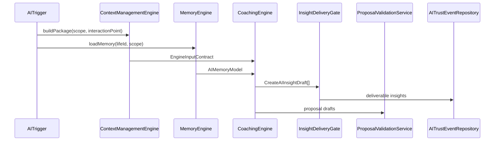
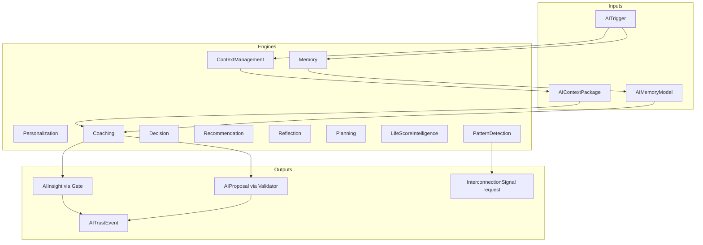

# Aether OS V2 — AI Domain (Bounded Context)

**Binding specification:** [`docs/aether-os-v2/AETHER-OS-V2-MASTER-AI-ARCHITECTURE.md`](../../../../docs/aether-os-v2/AETHER-OS-V2-MASTER-AI-ARCHITECTURE.md) (immutable)  
**Operational docs:** [`docs/aether-os-v2/`](../../../../docs/aether-os-v2/README.md) — Coach Doctrine, Insight Spec, Proposal Catalog, Trigger Dictionary, Evidence Dictionary, Ethics Red Team, Quality Framework  

This folder is the **domain architecture layer** for intelligence. It is not LLM integration, not chat UI, not prompts, not HTTP, not Prisma schema.

Future work wires **application services** and **infrastructure adapters** outside this boundary.

---

## Folder structure

```text
server/src/domain/ai/
├── README.md                          ← this document
├── index.ts                           ← public exports
├── adr/                               ← Architecture Decision Records
├── aggregates/
│   └── proposal-workflow.ts           ← AIProposal → accept → AdaptationApplication
├── boundaries/
│   ├── permission-matrix.ts           ← Forbidden/allowed write targets
│   └── engine-permissions.ts          ← Per-engine permission contracts
├── citations/
│   └── citation-framework.ts          ← Factual claims + DeliverableAIInsight gate
├── constants/
│   ├── governing-laws.ts
│   ├── evidence-classes.ts            ← Evidence Dictionary (code registry)
│   └── proposal-types.ts              ← Legal + illegal proposal enums
├── engines/
│   ├── engine-contract.ts             ← Input/output/dependency contracts
│   └── engine-modules.ts              ← Architecture stubs (throw until wired)
├── entities/
│   ├── ai-insight.ts
│   ├── ai-context-manifest.ts         ← AIContextManifest + AIContextPackage
│   ├── ai-proposal.ts                 ← AIProposal, AdaptationApplication, targets/decisions
│   ├── ai-interaction.ts
│   ├── ai-recommendation.ts           ← Priority, Reason, Recommendation
│   └── ai-trust-and-invocation.ts     ← AITrustEvent, AIRetraction, AIFailure, AITrigger
├── events/
│   └── ai-domain-events.ts
├── failures/
│   └── failure-handling-service.ts
├── memory/
│   └── memory-model.ts                ← Working/Episodic/Semantic/Archive/InsightGraph
├── repositories/
│   └── repository-interfaces.ts       ← Ports only
├── roles/
│   └── role-registry.ts               ← Composable AIRoleKind (no inheritance)
├── services/
│   └── retraction-service.ts
├── validation/
│   └── insight-and-proposal-validation.ts
├── value-objects/
│   ├── enums.ts
│   ├── ids.ts
│   └── evidence-reference.ts          ← AIEvidenceReference
└── workflows/
    └── interaction-orchestrator.ts      ← Trigger → engines → validation shell
```

---

## Aggregate boundaries

| Aggregate | Root | Consistency rule |
|-----------|------|------------------|
| **Insight delivery** | `AIInsight` | Deliver only via `InsightDeliveryGate` |
| **Proposal workflow** | `AIProposal` | Accept only via `ProposalWorkflowService` + human userId |
| **Trust audit** | `AITrustEvent` | Append-only log |
| **Memory read model** | `AIMemoryModel` | Evidence refs only; `CHAT_NOT_MEMORY` |
| **Interaction session** | `AIInteraction` | Transport turn count ≠ evidence |

---

## Engine modules (architecture stubs)

| Engine | `AIEngineKind` | Master AI Architecture |
|--------|----------------|------------------------|
| Coaching | `COACHING` | §4 |
| Decision | `DECISION` | §5 |
| Recommendation | `RECOMMENDATION` | §6 |
| Reflection | `REFLECTION` | §7 |
| Planning | `PLANNING` | §8 |
| Pattern Detection | `PATTERN_DETECTION` | §9 |
| Context Management | `CONTEXT_MANAGEMENT` | §11 |
| Personalization | `PERSONALIZATION` | §12 |
| Life Score Intelligence | `LIFE_SCORE_INTELLIGENCE` | §10 |
| Memory | `MEMORY` | §3 |

Each module exposes `execute()` throwing `ArchitectureOnlyEngineError` until an application-layer implementation is registered.

---

## Permission matrix (hard boundaries)

**Global forbidden writes (all engines):**

- `MasteryState`, `MasteryDelta`, `LifeScore`
- `SessionState`, `SessionEvidence`
- `LegacyRecordEvidenceSection`
- `SeasonActivateDomain` (without Season amend flow outside AI)
- `Achievement`

**Allowed AI writes (engine-specific):**

- `AIInsight`, `AIProposal`, `AITrustEvent`, `AIEngineInvocation`, `AIInteraction`
- `InterconnectionSignal` (Pattern Detection only)

See `boundaries/engine-permissions.ts`.

---

## Proposal workflow

```text
EngineOutput.proposalDrafts
  → ProposalValidationService (illegal type block)
  → persist AIProposal (status=PROPOSED)
  → Human accept/reject
  → ProposalWorkflowService.accept → AdaptationApplication
  → Application layer applies System version (outside AI domain)
```

No engine may call `accept()` — `mayAcceptProposal: false` is typed as `false`.

---

## Context workflow

```text
AITrigger + AIInteractionPoint + AIContextScope
  → ContextManagementEngine.buildPackage()
  → AIContextPackage { manifest, evidenceRefs, citationBudget, scope }
  → EngineInputContract
```

Scopes: **Operate**, **Steer**, **Understand**, **Remember**, **Legacy**, **Configure** (`AIContextScope`).

Manifest fields match Insight Specification §10 (entity inventory, redactions, privacy level).

---

## Memory graph

```text
AIMemoryModel
 ├── working      (today queue, open signals, recent session ids)
 ├── episodic     (indexed sessions/reflections + evidence refs)
 ├── semantic     (principles, system versions, coupling, persona)
 ├── archive      (legacy record ids + evidence refs)
 └── insightGraph (edges: insightId → AIEvidenceReference)
```

Chat: **`CHAT_NOT_MEMORY`** — transport only (Master AI Architecture §3).

---

## Citation system

- Registry: `constants/evidence-classes.ts` (maps to Evidence Dictionary doc)
- URI format: `evidence://{classKey}/{entityType}/{entityId}`
- `InsightDeliveryGate.pass()` → `DeliverableAIInsight<AIInsight>` branded type
- `EV-ChatTurn` tier **Invalid** — cannot validate as citation

---

## Interaction flow



---

## Engine communication diagram



---

## Package dependency diagram

```text
domain/ai (this folder)
  ↑ implemented by (future)
application/ai/*     orchestration, engine implementations, ports
  ↑
infrastructure/*     Prisma repos, LLM adapter (future), clock, id gen

domain/ai MUST NOT import application or infrastructure.
```

---

## Audit vs existing Aether architecture

| Area | Status | Notes |
|------|--------|-------|
| Master AI Architecture | **Aligned** | Laws, engines, roles, deny list encoded |
| Data Model §5.4–5.6 | **Aligned** | AIInsight, AIProposal, AdaptationApplication shapes |
| IA Coach interaction points | **Aligned** | `AIInteractionPoint` enum |
| Evidence Dictionary doc | **Aligned** | `EVIDENCE_CLASS_REGISTRY` |
| Proposal Catalog doc | **Aligned** | `AIProposalType` + `IllegalAIProposalType` |
| Existing Express routes | **Unchanged** | No coupling yet |
| Prisma schema | **Unchanged** | Per constraint — repos are interfaces only |
| Gamification routes | **Potential future conflict** | Legacy XP routes exist; AI forbidden writes include Achievement/LifeScore — application must not route gamification through AI |
| Progress dual source of truth | **Unchanged** | AI memory reads Sessions via future port — must not write progress |

**No contradictions** with master markdown specs. **Existing server** gamification/progress is not integrated with this domain (intentional).

---

## Recommendations (spec preserved — improvements)

These strengthen implementation **without** modifying Master AI Architecture:

1. **`EvidenceExistencePort`** — implement in infrastructure with Prisma batch lookup for citation validation at delivery time (Insight Spec §5 gate V2).
2. **Separate `application/ai/`** — register real engine implementations; keep `domain/ai` pure.
3. **`tsconfig.domain-ai.json`** — typecheck AI domain independently until legacy routes are strict-typed.
4. **Unify gamification** — long-term, route all scoreboard writes through non-AI domain services; AI remains explain-only for LifeScore.
5. **Trigger registry file** — optional code mirror of Trigger Dictionary (partial keys in orchestrator today).
6. **Proposal fingerprint** — hash `(proposalType, targetId, diffSummary)` for nag-window enforcement (Failure Handling §16).

---

## Typecheck

```bash
cd server
npx tsc -p tsconfig.domain-ai.json --noEmit
```

---

## Public API

```ts
import { InsightDeliveryGate, ProposalWorkflowService, ALL_ENGINE_MODULES } from './domain/ai';
```

See `index.ts` for full exports.

---

**End of AI Domain README.**
